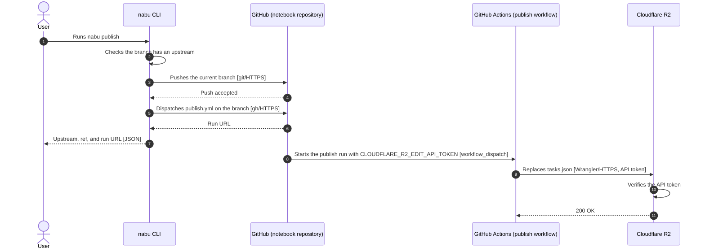

# Architecture

## nabu publish

```mermaid
sequenceDiagram
  autonumber
  actor User
  participant CLI as nabu CLI
  participant GitHub as GitHub (notebook repository)
  participant Actions as GitHub Actions (publish workflow)
  participant R2 as Cloudflare R2

  User->>CLI: Runs nabu publish
  CLI->>CLI: Checks the branch has an upstream
  CLI->>GitHub: Pushes the current branch [git/HTTPS]
  GitHub-->>CLI: Push accepted
  CLI->>GitHub: Dispatches publish.yml on the branch [gh/HTTPS]
  GitHub-->>CLI: Run URL
  CLI-->>User: Upstream, ref, and run URL [JSON]
  GitHub->>Actions: Starts the publish run with CLOUDFLARE_R2_EDIT_API_TOKEN [workflow_dispatch]
  Actions->>R2: Replaces tasks.json [Wrangler/HTTPS, API token]
  R2->>R2: Verifies the API token
  R2-->>Actions: 200 OK
```
